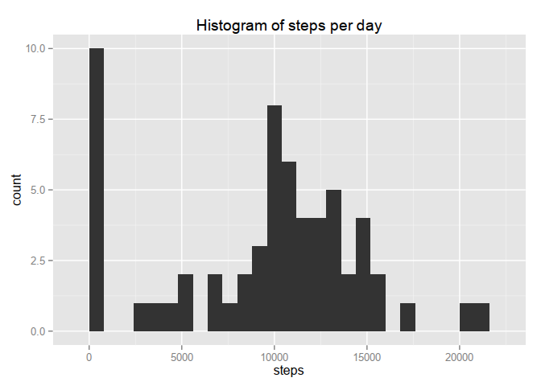
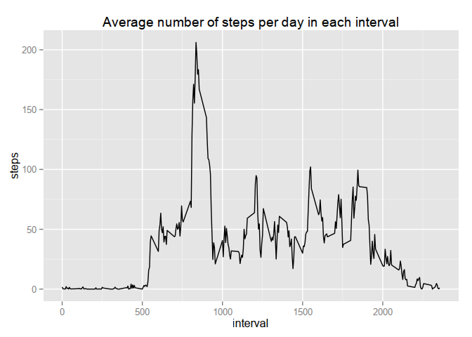
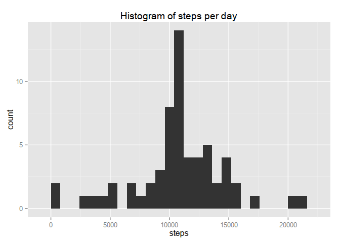
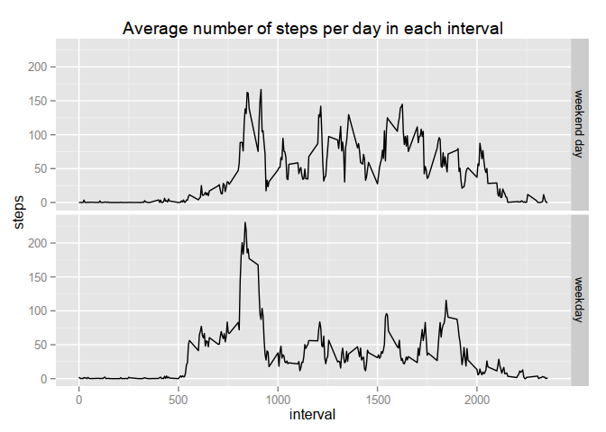

# Reproducible Research: Peer Assessment 1

This report shows an example of literate programming in the R programming language.


## Loading and preprocessing the data

Load the data from within the zip archive and preprocess the dates.

```r
data <- read.csv(unz("activity.zip", "activity.csv")) # read zip file
data$date    <- as.Date(data$date, "%Y-%m-%d")        # preprocess the dates
str(data)                                             # print basic summary
```

```
## 'data.frame':	17568 obs. of  3 variables:
##  $ steps   : int  NA NA NA NA NA NA NA NA NA NA ...
##  $ date    : Date, format: "2012-10-01" "2012-10-01" ...
##  $ interval: int  0 5 10 15 20 25 30 35 40 45 ...
```


## What is mean total number of steps taken per day?


```r
# plotting library
library(ggplot2)                                                                          
# calculate total steps per day
total <- tapply(data$steps, data$date, sum, na.rm=T)                                      
# plot
qplot(total, binwidth=20000/25) + ggtitle("Histogram of steps per day") + labs(x="steps") 
```

 
  
The mean number of steps per day is 9354.2295082.

```r
mean(total)
```

```
## [1] 9354.23
```
The median number of steps per day is 10395.

```r
median(total)
```

```
## [1] 10395
```

## What is the average daily activity pattern?


```r
# mean steps per interval
sPerInt <- tapply(data$steps, data$interval, mean, na.rm=T)                    
# transform into a dataframe for ggplot
sPerIntDF <- data.frame(interval=as.numeric(names(sPerInt)), aveSteps=sPerInt) 
# plot
ggplot(sPerIntDF, aes(interval,aveSteps)) + geom_line() + labs(y="steps") +    
    ggtitle("Average number of steps per day in each interval")
```

 
  
The interval with the highest average number of steps is 835.

```r
sPerIntDF[sPerIntDF$aveSteps==max(sPerIntDF$aveSteps),]$interval
```

```
## [1] 835
```


## Imputing missing values
The total number of steps with missing values is 2304.


```r
sum(is.na(data$steps))
```

```
## [1] 2304
```

```r
# create holder for clean data set
dataClean <- data
# fill in missing values with mean for that 5-min interval
dataClean$steps <- ifelse(is.na(data$steps), sPerInt[as.character(data$interval)] , data$steps)
# re-calculate total steps per day
total2 <- tapply(dataClean$steps, dataClean$date, sum, na.rm=T)  
qplot(total2, binwidth=20000/25) + ggtitle("Histogram of steps per day") + labs(x="steps") # plot
```

 
  
The mean number of steps per day is 10766.19 up from 9354.23 before missing value replacment.

```r
mean(total2)
```

```
## [1] 10766.19
```
The median number of steps per day is 10766.19 up from 10395 before missing value replacment.

```r
median(total2)
```

```
## [1] 10766.19
```
Both mean and median have increased. This is to be expected as in the first histogram we can see 10 days in the smallest bin. This is an unrealistically low number of steps for a day. It is probably caused by the device not being worn much or at all  that day.   

In the histogram with replaced values only two days have are left in the smallest bin. Comparing the two histograms it can be seen that the other 8 days have moved to the middle of the histogram.

## Are there differences in activity patterns between weekdays and weekends?


```r
# add weekend factor to dataClean dataframe
dataClean$weekday <- as.factor(weekdays(dataClean$date))
dataClean$weekend <- as.factor(ifelse(dataClean$weekday %in%
                                          c("Saturday", "Sunday"),"weekend day","weekday"))

# method to calculate the mean steps per interval for a given weekday type.
getByDayType <- function(weekendStr) {
    # filter dataClean by weekday type
    dataWEND <- dataClean[dataClean$weekend==weekendStr,]                 
    # calculate mean steps per interval
    sPerInt   <- tapply(dataWEND$steps, dataWEND$interval, mean, na.rm=T) 
    # transform into a dataframe for ggplot
    sPerIntDF <- data.frame(interval=as.numeric(names(sPerInt)), aveSteps=sPerInt, weekend=weekendStr)
}

# call the above method for 'weekend day' and 'weekday' and bind into one dataframe
sPerIntDF <- rbind(getByDayType("weekend day"), getByDayType("weekday"))
ggplot(sPerIntDF, aes(interval,aveSteps)) + geom_line() + facet_grid(weekend~.) +    # plot
    labs(y="steps") + ggtitle("Average number of steps per day in each interval")
```

 
  
  
Weekends see slightly more evenly spread total step averages over the midday period.
